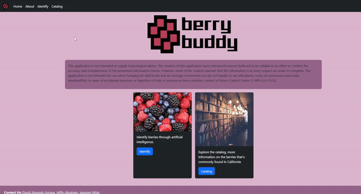

# *BerryBuddy Website*

BerryBuddy Python version, trained model, text from
https://github.com/jeffin-abraham/berry-buddy

## About BerryBuddy Website
BerryBuddy is a web application that allows a user to identify berries through artificial intelligence.

## Background
California’s wilderness is home to a diverse range of berries. There are too many berries for new foragers to reliably be able to identify which poses the risk of consuming poisonous or toxic varieties. This is especially dangerous since some of the toxic berries look and grow in the same places as commonly eaten berries. For instance, the Aralia Spinosa berry and American Elderberry are both bunched blackberries that grow out of red branches. Therefore, foragers need a tool that can help them distinguish between edible berries and potentially fatal ones, as well as a way to mark which berry bushes grow fruits that are safe to consume.

## Proposed Solution
BerryBuddy is a web application that allows the users to identify berries through artificial intelligence.
BerryBuddy utilizes machine learning libraries in Python to train a neural net to identify and differentiate between the various berries endemic to California.
Our program is able to identify berries in user-provided images, and relay relevant information.
## Libraries and Sources
Bootstrap, Tom Select, p5.js, ml5.js, https://github.com/jeffin-abraham/berry-buddy